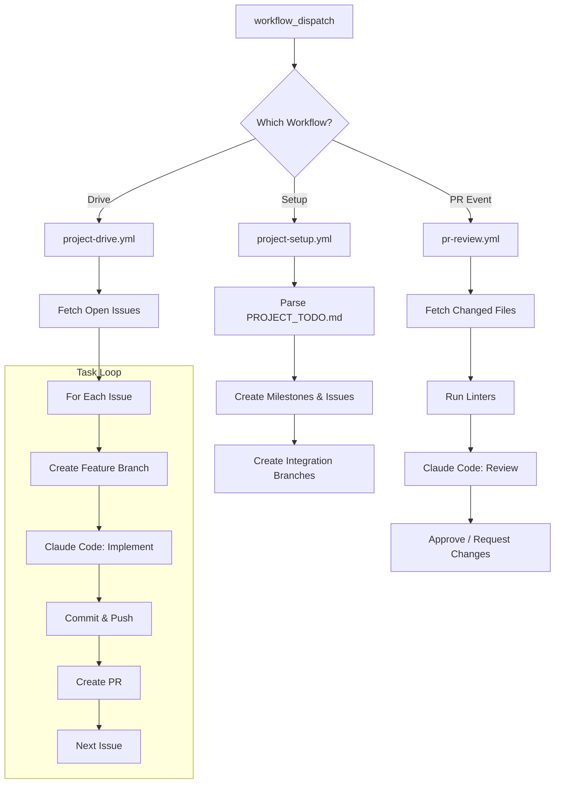

# GitHub Actions Template Skill

This skill provides GitHub Actions workflow templates that automate the entire **project-workflow** pipeline. Instead of running the workflow locally, you can trigger it directly from GitHub Actions — enabling fully autonomous project execution.

## Architecture



## Workflows

### 1. `project-setup.yml` — Initialize Project

Syncs a `PROJECT_TODO.md` file to GitHub Milestones and Issues.

**Trigger**: `workflow_dispatch`

| Input | Required | Description |
|:------|:---------|:------------|
| `todo_file` | Yes | Path to the PROJECT_TODO.md file |
| `skills_repo` | No | Skills repository (default: `PCHANUL/Skills`) |

**What it does**:
1. Checks out the target repository
2. Clones the Skills repository
3. Runs `sync_to_github.py` to create Milestones, Issues, and Integration Branches

### 2. `project-drive.yml` — Drive Milestone Execution

The main orchestrator. Iterates through all open issues in a milestone and uses Claude Code to implement each one.

**Trigger**: `workflow_dispatch`

| Input | Required | Description |
|:------|:---------|:------------|
| `milestone` | Yes | Milestone title (e.g., `Phase 1: MVP`) |
| `skills_repo` | No | Skills repository (default: `PCHANUL/Skills`) |
| `test_command` | No | Test command to run after implementation (e.g., `npm test`) |

**What it does**:
1. Fetches all open issues for the milestone (sorted by number)
2. Determines the integration branch (`milestone/phase-N`)
3. For each issue sequentially:
   - Creates a feature branch (`feat/issue-N-title`)
   - Invokes Claude Code to read the issue and implement the requirements
   - Commits changes and pushes
   - Creates a PR targeting the integration branch

**Required Secrets**:
- `ANTHROPIC_API_KEY` — For Claude Code execution

### 3. `pr-review.yml` — Automated PR Review

Automatically reviews Pull Requests using Claude Code when they are opened or updated.

**Trigger**: `pull_request` (opened, synchronize, ready_for_review)

**What it does**:
1. Fetches the list of changed files in the PR
2. Runs project-appropriate linters
3. Invokes Claude Code to perform a context-aware code review
4. Posts the review as a PR comment
5. Approves or requests changes based on the analysis

**Required Secrets**:
- `ANTHROPIC_API_KEY` — For Claude Code execution

## Setup

### Quick Setup

Run the installer script from your target repository:

```bash
python3 ~/Skills/github-actions-template/scripts/setup.py --repo /path/to/your/repo
```

This copies all workflow files into your repository's `.github/workflows/` directory.

### Manual Setup

1. Copy the workflow files from `workflows/` to your repository's `.github/workflows/`
2. Add the required secrets to your repository:
   - `ANTHROPIC_API_KEY`: Your Anthropic API key

### Required Repository Secrets

| Secret | Required By | Description |
|:-------|:-----------|:------------|
| `ANTHROPIC_API_KEY` | `project-drive.yml`, `pr-review.yml` | Anthropic API key for Claude Code |

## Configuration

### Customizing Workflows

Each workflow supports customization through inputs. You can also modify the workflow files directly after installation:

- **Change the Claude model**: Edit the `model` parameter in the Claude Code action step
- **Add custom linters**: Add steps before the Claude Code review in `pr-review.yml`
- **Adjust permissions**: Modify the `permissions` block in each workflow
- **Add environment variables**: Use the `env` section for project-specific settings

### Integration with Existing CI/CD

The workflows are designed to coexist with your existing CI/CD pipelines:

- `project-setup.yml` and `project-drive.yml` are manual-trigger only (`workflow_dispatch`)
- `pr-review.yml` can be configured with path filters to avoid conflicts with other PR checks

## Key Commands

| Action | How |
|:-------|:----|
| **Install workflows** | `python3 ~/Skills/github-actions-template/scripts/setup.py --repo /path/to/repo` |
| **Setup project** | GitHub Actions → `project-setup` → Run workflow |
| **Drive milestone** | GitHub Actions → `project-drive` → Run workflow (input: milestone name) |
| **PR Review** | Automatic on PR creation/update |

## Limitations

- **GitHub Actions runner time**: Complex milestones with many issues may exceed the 6-hour job limit. Consider breaking large milestones into smaller phases.
- **API rate limits**: Sequential issue processing includes delays to respect GitHub API rate limits.
- **Interactive steps**: The GitHub Actions version operates fully autonomously — there is no interactive confirmation between steps (unlike the local `drive.py`).
