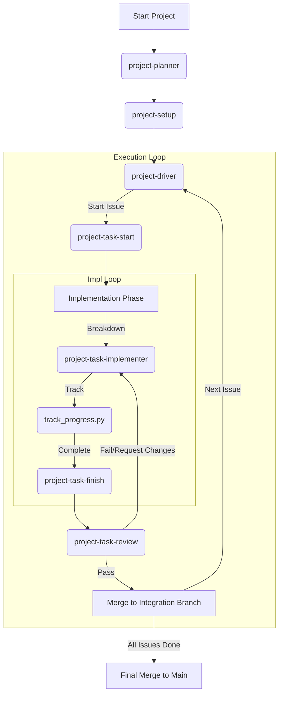

# Project Workflow Master Guide

This skill documents the standard operating procedure for executing software projects using the Antigravity Skill System.

## Workflow Overview

## Detailed Steps

### 1. Planning Phase (`project-planner`)
- **Goal**: Define what to build.
- **Action**: Create `PROJECT_TODO.md`.
- **Key Concepts**: Phased Milestones (Phase 1, Phase 2...), Weekly Goals.

### 2. Setup Phase (`project-setup`)
- **Goal**: Sync plan to GitHub.
- **Action**: Run `python3 .../sync_to_github.py`.
- **Outcome**: 
    - GitHub Milestones created.
    - GitHub Issues created.
    - **Integration Branch** (`milestone/phase-1`) & **Integration PR** automatically created.

### 3. Execution Phase (`project-driver`)
- **Goal**: Execute the plan autonomously.
- **Action**: Run `python3 .../drive.py --milestone "Phase 1: MVP"`.
- **Features**:
    - **Auto-Resume**: Remembers progress in `DRIVER_STATE.json`.
    - **Sequential Execution**: Handles one issue at a time.

#### 3.1. Task Start (`project-task-start`)
- **Action**: Creates feature branch from Integration Branch.
- **Idempotency**: If branch `feat/issue-{N}` already exists, it simply checks it out (Resume Mode).

#### 3.2. Implementation (`project-task-implementer`)
- **Goal**: Write code iteratively.
- **Tool**: `track_progress.py` (The "External Brain").
    - `init "Task A" "Task B"`: Create plan.
    - `list`: Check what's next.
    - `complete 1`: Mark done.

#### 3.3. Finish (`project-task-finish`)
- **Action**: Commit changes and create PR.
- **Safety**: 
    - Checks for existing PRs to avoid duplicates.
    - (Configurable) Runs tests before commit.
- **Target**: PR base defaults to `main`, but Driver will update it to Integration Branch.

#### 3.4. Review (`project-task-review`)
- **Goal**: Quality Assurance.
- **Action**: Analyze code against conventions.
- **Loop**: 
    - If **Fail**: Go back to Implementation.
    - If **Pass**: Merge to Integration Branch, **update Integration PR with completed issue**, & Delete feature branch.

### 4. Safety & Edge Cases

- **Merge Conflicts**: If `git pull` fails in `drive.py`, the driver will stop. Resolve conflicts manually, then run with `--resume`.
- **Network Errors**: All scripts use `gh` CLI which handles some retries, but persistent failures require manual intervention.
- **Test Failures**: `finish.py` can be configured to block commits if tests fail. Fix the code before retrying.

### 4. Completion Phase
- **Goal**: Ship the milestone.
- **Action**: Merge `milestone/phase-1` into `main`.

## Key Commands Cheat Sheet

| Phase | Command |
| :--- | :--- |
| **Plan** | (Manual creation of `PROJECT_TODO.md`) |
| **Sync** | `python3 ~/Skills/project-setup/scripts/sync_to_github.py --file PROJECT_TODO.md --repo owner/repo` |
| **Drive** | `python3 ~/Skills/project-driver/scripts/drive.py --milestone "Phase 1: MVP"` |
| **Resume**| `python3 ~/Skills/project-driver/scripts/drive.py --resume` |
| **Track** | `python3 ~/Skills/project-task-implementer/scripts/track_progress.py [init|list|complete]` |
